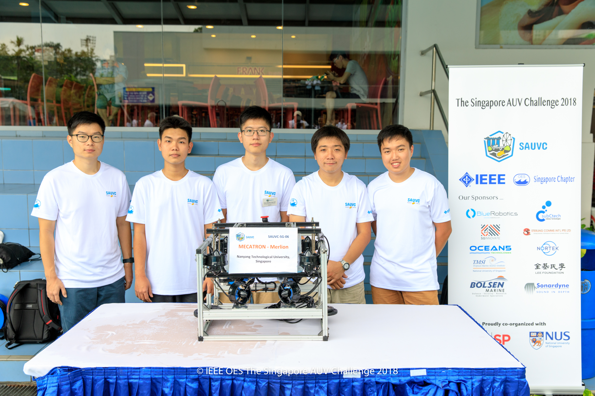

# merlion_sauvc

<div align="center"></div>

## Introduction
Repository for Team Merlion to participate in [SAUVC 2018](https://sauvc.org/). This is a ROS-based project.

A demo video of our team AUV can be found at [Team Merlion AUV](https://www.youtube.com/watch?v=e0qRCkM5vdQ)

## Goals

### TODO list
- [ ] Win

## Requirements
- ROS Kinetic (Ubuntu 16.04 LTS).
  - ROS Indigo (Ubuntu 14.04 LTS) may work but is no longer supported.

- Install package dependencies:
```
sudo apt-get install ros-kinetic-usb-cam ros-kinetic-mavros ros-kinetic-joy
sudo apt-get install ros-kinetic-rosserial-arduino ros-kinetic-rosserial
```

- (Optional) Arduino ([IDE](https://www.arduino.cc/en/Main/Software), [rosserial_arduino](http://wiki.ros.org/rosserial_arduino/Tutorials) for low-level EStop) and Servo

Additionally, install `bluerov` package from [source](https://github.com/bluerobotics/bluerov-ros-pkg#installation-from-source) (apt does not work).

## Setup
### Wake-on-LAN
Follow the instruction from [here](http://kodi.wiki/view/HOW-TO:Set_up_Wake-on-LAN_for_Ubuntu).

IP address 192.168.1.119(eth0)/192.168.1.129(wlan) was reserved for NUC

From ground PC:
```
sudo apt-get install powerwake
powerwake 192.168.1.119
```

### udev
Udev rules files are stored in `merlion_setup/udev_rules`.

After adding the necessary rules into `/etc/udev/rules.d/`, do
```
sudo udevadm control --reload-rules && sudo service udev restart && sudo udevadm trigger
```

### SSH
From ground PC:
```
ssh usv@192.168.1.119
```

Add these lines on ground PC into *~/.bashrc* to work with NUC ROS master
```
export ROS_MASTER_URI=http://192.168.1.119:11311
export ROS_IP=192.168.1.xxx # your IP
```
Remove (comment) those lines if you want to work with a local ROS master

### Control
TODO: Update this
```
roslaunch merlion_bringup merlion_bringup.launch
```

In ground PC, plug in the joystick and use QGroundControl or ros teleop
```
roslaunch merlion_bringup joy_bringup.launch
```

### Vision
```
roslaunch merlion_bringup sensors.launch
roslaunch merlion_bringup image_view.launch
```
Fixing webcam node died:
```
sudo rmmod uvcvideo
sudo modprobe uvcvideo
```
